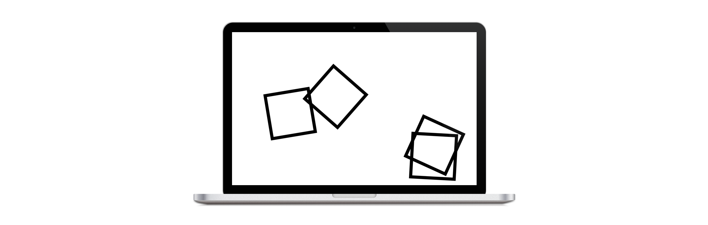
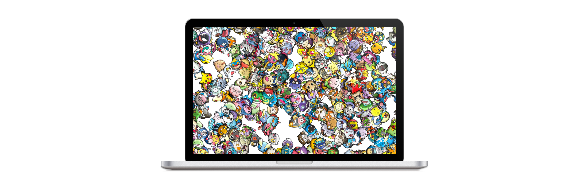

A simple screen saver that sends icons careening all over your screen. Simply provide a set of icons to display.

I highly recommend finding and using sprites from the Pokémon games:

The screen saver package can be downloaded from the [releases page](https://github.com/Marxon13/IconJumble/releases). The release also contains an app that is a demo of the screen saver (Open the app preferences to play with the screen saver configuration.)

##Table of Contents

* [**Recent Changes**](#recent-changes)
* [**Documentation**](#documentation) 
* [**Getting Started**](#getting-started)
    * [Installation](#installation)
    * [Use](#use)
* [**Project Structure**](project-structure)
* [**Project Details**](project-details)
    * [Requirements](requirements)
    * [Support](support)
    * [Todo](todo)
    * [License](license)

##Recent Changes

- **1.0.0:** Created the screen saver!

##Documentation

The screen saver has a few configurable properties.

- **Screen Saver Options:** The tab with the global screen saver options.
    - **Icon Group:** The folder of icons to display.
    - **Random Group:** Whether or not to display a random group of icons each time the screen saver is loaded.

- **Icon Group Options:** Options pertaining to a specific icon group.
    - **Icon Group:** The icon group to change the settings for.
    - **Maximum Speed:** The maximum speed at which icons will travel across your screen.
    - **Maximum Rotational Speed:** The maximum speed at which icons will rotate. (This is the most common adjustment to be made, as smaller icons will rotate faster.)

- **Open Icon Library:** This button opens a Finder window to your icon library. Just place folders of PNGs into this folder to have them accessible to the screen saver.

##Getting Started

### Installation

Simply download the latest release from the [releases page](https://github.com/Marxon13/IconJumble/releases), unzip the download, and double click the "WhatColorIsIt.saver" file to install it.

### Use

To set and configure the screen saver, open `System Preferences` and navigate to the `Desktop & Screen Saver` page. In the left hand column, select the `Icon Jumble` screen saver to set it as the screen saver for the display. 

To configure the screen saver, press the `Screen Saver Options` button to open the configuration panel. Press `OK` to save the changes.

For any icon sets you want to be loaded by the screen saver, open the `Screen Saver Options` and press the `Open Icon Library` button to open the folder where the icons are stored. Each icon set is stored in a folder in this folder. Just copy the folders of PNGs to this directory to have them loaded by the screen saver. Again, I highly recommend Pokémon sprites.

##Project Structure

**Icon Jumble**

This is the target that builds the screen saver. The screen saver has four components:
    
- **IconJumbleView:** The view that renders the screen saver.
- **IconJumbleScene:** The SpriteKit scene that controls the screen saver logic/physics.
- **IconJumbleDefaults:** Stores the configuration of the screen saver and saves changes to disk.
- **IconJumbleConfigurationWindowController:** Controls the configuration window. Tying the controls to the default configuration.

**Icon Jumble Demo**

A simple macOS app to help with debugging the screen saver. It simply displays the screen saver and its configuration view. The configuration view can be shown by opening the app preferences (Command + Comma).

##Project Details

### Requirements

- Runs on macOS El Capitan (10.11) or later.
- Requires Xcode 8 / Swift 3.0 to build

### Support

Open an issue or shoot me an email. Check out previous issues to see if your's has already been solved. (I would prefer an issue over an email. But will still happily respond to an email.)

### Todo

- I have no ideas, open an issue if you have one.

------

>Copyright (c) 2016 Brandon McQuilkin

>Permission is hereby granted, free of charge, to any person obtaining a copy of this software and associated documentation files (the "Software"), to deal in the Software without restriction, including without limitation the rights to use, copy, modify, merge, publish, distribute, sublicense, and/or sell copies of the Software, and to permit persons to whom the Software is furnished to do so, subject to the following conditions:

>The above copyright notice and this permission notice shall be included in all copies or substantial portions of the Software.

>THE SOFTWARE IS PROVIDED "AS IS", WITHOUT WARRANTY OF ANY KIND, EXPRESS OR
IMPLIED, INCLUDING BUT NOT LIMITED TO THE WARRANTIES OF MERCHANTABILITY,
FITNESS FOR A PARTICULAR PURPOSE AND NONINFRINGEMENT. IN NO EVENT SHALL THE AUTHORS OR COPYRIGHT HOLDERS BE LIABLE FOR ANY CLAIM, DAMAGES OR OTHER
LIABILITY, WHETHER IN AN ACTION OF CONTRACT, TORT OR OTHERWISE, ARISING FROM, OUT OF OR IN CONNECTION WITH THE SOFTWARE OR THE USE OR OTHER DEALINGS IN
THE SOFTWARE.